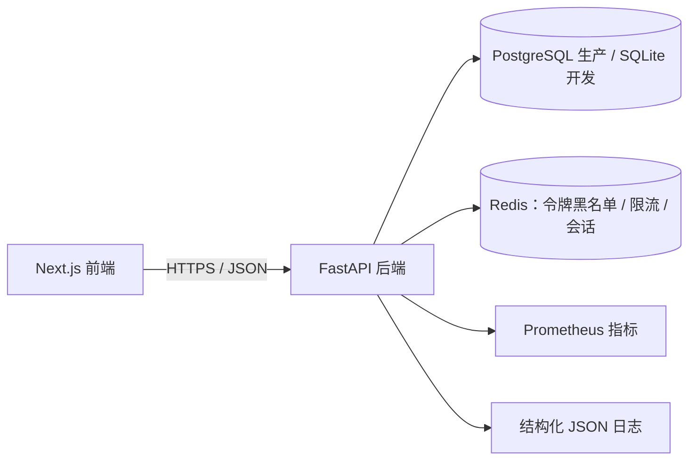

# 跨境产品资料中英对照系统

[](https://github.com/S4saK1/cross-border-ops-dashboard-/actions)
[](https://github.com/S4saK1/cross-border-ops-dashboard-/releases)
[](https://opensource.org/licenses/MIT)
[](https://www.python.org/downloads/)
[](https://nodejs.org/)

> 不是翻译工具，是跨境卖家的产品资料一致性管理系统

## 项目简介

跨境产品资料中英对照系统（Cross-Border Product CMS）是面向跨境卖家的一站式产品资料管理平台，帮助卖家集中维护产品参数的中英文对照关系，并在导出到全球电商平台（Amazon、AliExpress 等）之前自动校验一致性，确保产品资料准确、统一、专业。

**v2.0.0（2026-08-01）** 在 v1.0.0 基础上完成安全加固与工程化收尾：Redis 限流、CSRF 防护、JWT 令牌黑名单、Alembic 数据库迁移、统一审计日志，并让 CI 管道全绿（171 项测试通过、覆盖率 72.45%、flake8/bandit/gitleaks 零问题）。

### 核心特性

- **术语一致性**：内置 100+ 专业术语词典，产品参数自动对照校验（L1 精确匹配 + 同义词匹配），导出前一致性阻断
- **批量管理**：CSV / Excel 批量导入，导入前预览与字段映射，导出支持 Amazon、AliExpress 模板
- **质量检测**：自动检测产品资料的中英文对照一致性，输出问题报告与修复建议
- **权限管理**：基于角色的访问控制（admin / editor / reviewer / viewer），多用户协作
- **审计追踪**：完整记录登录、登出、导入、导出、用户管理等操作日志
- **现代化界面**：基于 Next.js 14 + React 18 的响应式 Web 界面

## 技术架构



### 后端

- **框架**：Python FastAPI
- **数据库**：PostgreSQL（生产）/ SQLite（开发默认），SQLAlchemy 2.0 ORM + Alembic 迁移
- **缓存**：Redis（Token 黑名单、限流、会话存储）
- **认证**：JWT（access / refresh 分离）+ httpOnly Cookie + CSRF Token
- **密码加密**：bcrypt + 强度校验
- **API 文档**：自动生成 OpenAPI / Swagger

### 前端

- **框架**：Next.js 14 + React 18
- **样式**：Tailwind CSS
- **语言**：TypeScript（严格模式）
- **状态管理**：React Context + Hooks

### 部署与可观测

- **容器化**：Docker + Docker Compose（开发 / 测试 / 预发布 / 生产多套编排）
- **反向代理**：Nginx + TLS
- **监控**：Prometheus + Grafana + Alertmanager
- **备份**：`scripts/backup.sh`（pg_dump / SQLite 双模式 + GPG 加密 + S3/SFTP）

## 项目结构

```text
.
├── backend/          # FastAPI 后端（app/、alembic/、tests/）
├── frontend/         # Next.js 前端
├── deploy/           # 生产部署：nginx、监控、备份编排
├── docs/             # PRD、API 参考、实施指南、ADR、监控指南
├── monitoring/       # Prometheus / Grafana / Alertmanager 配置
├── scripts/          # 运维与工具脚本
├── docker-compose*.yml
└── README.md
```

## 快速开始

### 本地开发

```bash
# 1. 克隆项目
git clone https://github.com/S4saK1/cross-border-ops-dashboard-.git
cd cross-border-ops-dashboard-

# 2. 启动后端
cd backend
pip install -r requirements.txt
cp ../.env.example ../.env   # 并设置 SECRET_KEY / ADMIN_PASSWORD
python init_db.py
python -m uvicorn app.main:app --reload --port 8000

# 3. 启动前端
cd ../frontend
npm install
npm run dev
```

访问地址：

- 前端界面：http://localhost:3000
- API 文档：http://localhost:8000/docs
- 默认管理员：`admin@bilingual-product-cms.com`（密码由环境变量 `ADMIN_PASSWORD` 指定，首次登录请修改）

### Docker 一键部署

```bash
cp .env.example .env
# 生成 SECRET_KEY（Linux/Mac）
sed -i "s/^SECRET_KEY=.*/SECRET_KEY=$(openssl rand -hex 32)/" .env

docker compose up -d --build

# 验证
curl http://localhost:8000/health
docker compose ps
```

更详细的步骤见 [QUICKSTART.md](QUICKSTART.md) 与 [DEPLOY.md](DEPLOY.md)。

## 安全设计

- **令牌安全**：JWT access / refresh 分离，refresh token 仅存 httpOnly Cookie（ADR-007），令牌可吊销（Redis + DB 双写黑名单），启动时自动清理过期条目
- **CSRF 防护**：Cookie 认证场景下的 CSRF Token 中间件
- **限流**：登录 / 注册接口 Redis 滑动窗口限流（5 次 / 60 秒）
- **权限**：RBAC 四角色，注册强制 viewer 角色防提权，refresh token 不可冒充 access token
- **密钥管理**：`SECRET_KEY` 等敏感配置仅从环境变量读取，不写入仓库；生产环境 Cookie 自动启用 `Secure`
- **输入防护**：CSV 公式注入清洗，导入路径穿越防护，异常响应不泄露内部路径

## API 概览

- 认证：`POST /api/v1/auth/login`、`register`、`refresh`、`logout`、`me`、`change-password`
- 产品：`GET/POST /api/v1/products`、`GET/PUT/DELETE /api/v1/products/{id}`
- 术语：`GET/POST /api/v1/terms`
- 用户（管理员）：`/api/v1/users` CRUD、角色变更、密码重置、批量操作
- 导入：`POST /api/v1/import/upload`、`preview`、`execute`
- 导出：`POST /api/v1/export/csv`（Amazon / Alibaba）
- 审计：`GET /api/v1/audit-logs`
- 指标：`/metrics/prometheus`（受保护）

完整端点与请求示例见 [docs/api-reference.md](docs/api-reference.md) 和运行中的 `/docs`。

## 测试与质量

```bash
cd backend
pytest                                    # 171 passed / 2 skipped，覆盖率 72.45%
flake8 app/ --max-complexity=10 --max-line-length=127
bandit -r app/ -ll
```

CI 管道（[.github/workflows/ci-cd.yml](.github/workflows/ci-cd.yml)）依次执行：gitleaks 密钥扫描 → flake8 → bandit → safety → pytest（PostgreSQL + Redis 服务，覆盖率门禁 70%）→ Docker 镜像构建并推送 GHCR。

## 生产部署

- **安全配置**：设置强 `SECRET_KEY` 与 `ADMIN_PASSWORD`，配置 CORS 白名单，Nginx 启用 HTTPS
- **数据库迁移**：`alembic upgrade head`（v2.0 起由 Alembic 统一管理 schema）
- **数据备份**：`scripts/backup.sh`，支持 pg_dump / SQLite 双模式与远端加密备份
- **监控告警**：Prometheus + Grafana + Alertmanager，配置见 [monitoring/](monitoring/) 与 [docs/monitoring-guide.md](docs/monitoring-guide.md)
- **部署检查清单**：[deploy/deployment-checklist.md](deploy/deployment-checklist.md)

## 版本历史

- [CHANGELOG.md](CHANGELOG.md)：v2.0.0（2026-08-01）、v1.1.0（2026-07-30）、v1.0.0（2026-07-23）

## 贡献指南

欢迎任何形式的贡献。请先阅读 [CONTRIBUTING.md](CONTRIBUTING.md) 与 [行为准则](CODE_OF_CONDUCT.md)，通过 [GitHub Issues](https://github.com/S4saK1/cross-border-ops-dashboard-/issues) 反馈问题。

## 许可证

本项目采用 [MIT 许可证](LICENSE)。

---

**注意**：本系统不是通用的翻译工具，而是专门针对跨境卖家的产品资料一致性管理解决方案。我们专注于确保产品参数在不同语言版本间的一致性，而不是进行实时翻译。
